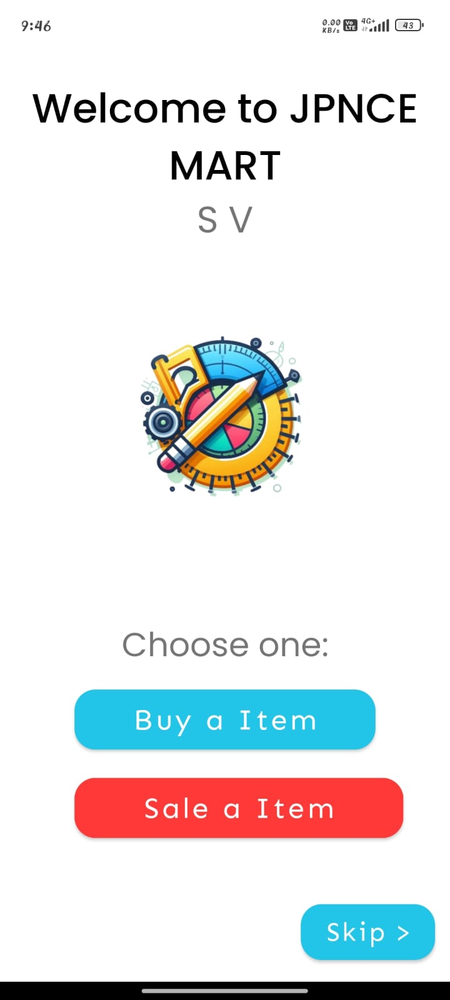
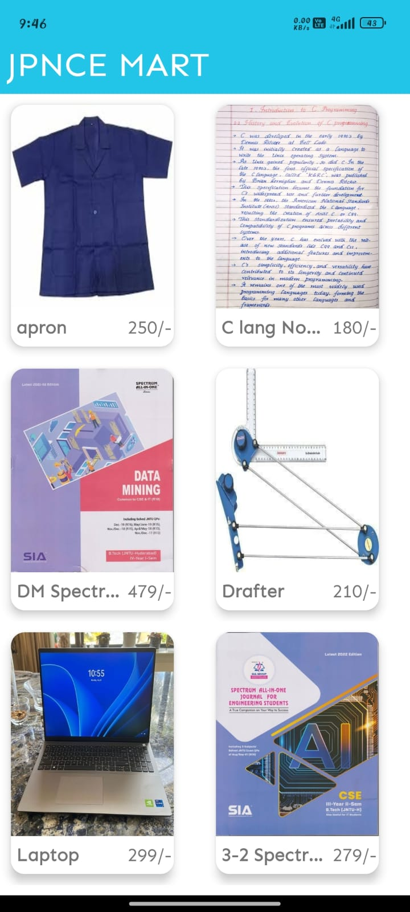
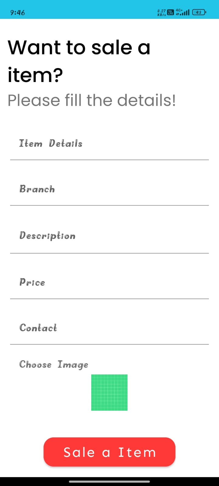
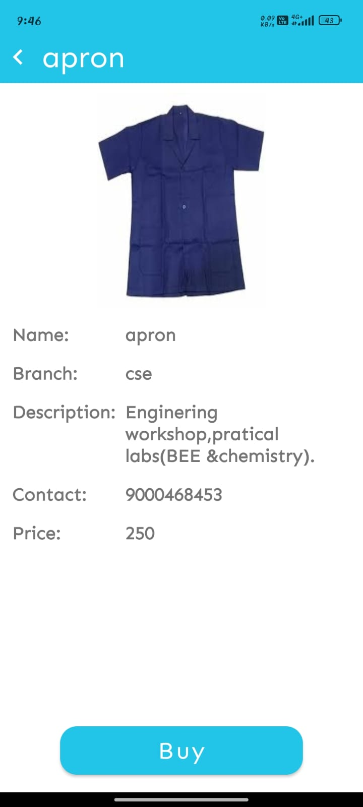

# 📘 COLLEGE ECOMMERECE APP (JPNCE MART)

JPNCE MART is a mobile application built for students to **buy and sell academic essentials** such as lab materials, books, notes, and stationery.  
It helps students easily find required items at affordable prices within their campus community.

---

## 🚀 Features
- 🔹 **Buy Items** – Browse a catalog of products with details like name, price, branch, and description.  
- 🔹 **Sell Items** – Post your own items by adding images, price, and contact details.  
- 🔹 **Simple UI** – Clean and student-friendly interface.  
- 🔹 **Affordable** – Connects students directly for low-cost deals.  

---

## 📱 Screenshots

### Welcome Screen  

### Dashboard (Buy Items)  

### Add Item (Sell Items)  

### Sample Product Page  

---

## 🛒 Example Items
- Apron – ₹250  
- C Language Notes – ₹180  
- Data Mining Book – ₹479  
- Drafter – ₹210  
- Laptop – ₹299  

## 🛠️ Tech Stack
- **Programming Language:** Java  
- **UI Design:** XML (Android Layouts)  
- **Database:** SQL (SQLite)  
- **IDE:** Android Studio  
